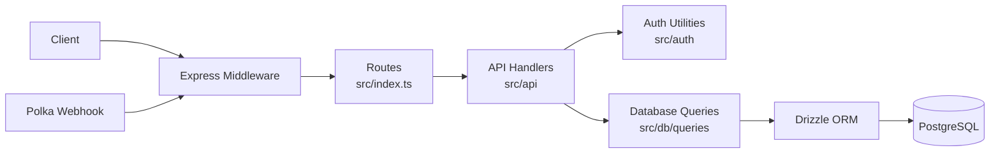
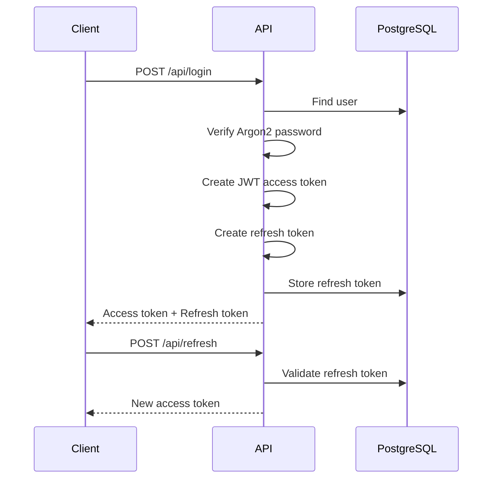
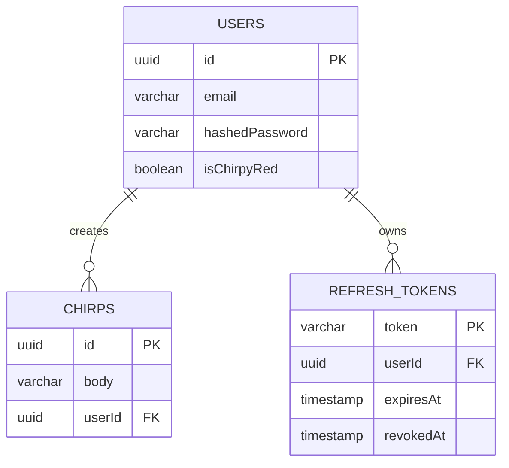

<div align="center">


# Chirpy

### A backend HTTP API built with TypeScript, Express, PostgreSQL, and Drizzle ORM.

<p>
  
  
  
  
  
  
</p>

<p>
  <a href="#features">Features</a> •
  <a href="#api">API</a> •
  <a href="#authentication">Authentication</a> •
  <a href="#database">Database</a> •
  <a href="#getting-started">Getting Started</a>
</p>

</div>

---

## Overview

Chirpy is a backend API for a small social platform where users can create short posts called **chirps**.

The server provides user authentication, refresh-token sessions, authorization, PostgreSQL persistence, chirp management, filtering and sorting, webhook handling, and centralized HTTP error handling.

## Features

### Authentication & Security
- User registration and login
- Argon2 password hashing
- JWT access tokens
- Persistent refresh tokens with expiration and revocation
- Ownership-based authorization
- API-key protected webhooks

### Chirps
- Create, retrieve, and delete chirps
- 140-character limit and profanity filtering
- Filter chirps by author
- Sort chirps by creation time

### Backend
- PostgreSQL persistence with Drizzle ORM
- Database migrations
- Centralized error handling
- Request logging middleware
- Health and admin endpoints
- Polka webhook integration
- Vitest authentication tests

## Architecture



- Access tokens expire after **1 hour**
- Refresh tokens expire after **60 days**
- Revoked or expired refresh tokens are rejected

## Tech Stack

| Technology | Role |
| --- | --- |
| TypeScript | Application language |
| Node.js | Runtime |
| Express | HTTP server and routing |
| PostgreSQL | Relational database |
| Drizzle ORM | Database queries and schema |
| Argon2 | Password hashing |
| JSON Web Tokens | Access-token authentication |
| Vitest | Unit testing |

## API

| Method | Endpoint | Authentication | Description |
| --- | --- | --- | --- |
| `GET` | `/api/healthz` | None | Health check |
| `POST` | `/api/users` | None | Create a user |
| `PUT` | `/api/users` | Access token | Update the authenticated user |
| `POST` | `/api/login` | None | Login and receive access and refresh tokens |
| `POST` | `/api/refresh` | Refresh token | Create a new access token |
| `POST` | `/api/revoke` | Refresh token | Revoke a refresh token |
| `GET` | `/api/chirps` | None | Get chirps |
| `GET` | `/api/chirps/:chirpId` | None | Get one chirp |
| `POST` | `/api/chirps` | Access token | Create a chirp |
| `DELETE` | `/api/chirps/:chirpId` | Access token | Delete an owned chirp |
| `POST` | `/api/polka/webhooks` | API key | Handle Polka webhook events |
| `GET` | `/admin/metrics` | None | View file-server metrics |
| `POST` | `/admin/reset` | Development only | Reset users and metrics |

The routes above match the routes currently registered by the server. 

### Filtering

Filter chirps by author:

```http
GET /api/chirps?authorId=<USER_ID>
```

### Sorting

Oldest first:

```http
GET /api/chirps?sort=asc
```

Newest first:

```http
GET /api/chirps?sort=desc
```

The default sort order is ascending.

Filtering and sorting can be combined:

```http
GET /api/chirps?authorId=<USER_ID>&sort=desc
```

## Authentication

Protected endpoints receive credentials through the `Authorization` header.

### Access Token

```http
Authorization: Bearer <ACCESS_TOKEN>
```

Access tokens are signed JWTs and expire after one hour.

### Refresh Token

```http
Authorization: Bearer <REFRESH_TOKEN>
```

Refresh tokens are stored in PostgreSQL and are accepted only while they are unexpired and not revoked.

### Webhook API Key

```http
Authorization: ApiKey <POLKA_KEY>
```

The current implementation verifies JWTs, Bearer tokens and API keys in `src/auth/tokens.ts`.  Refresh tokens are checked for both expiration and revocation before being accepted. 

## Authentication Flow



The implementation currently uses a one-hour access-token lifetime and a 60-day refresh-token lifetime. 

## Project Structure

```text
src/
├── api/        # route handlers, webhooks, metrics, and middleware
├── app/        # static files and assets
├── auth/       # password hashing, JWTs, API keys, and auth tests
├── db/
│   ├── migrations/
│   ├── queries/
│   ├── index.ts
│   ├── migrate.ts
│   └── schema.ts
├── errors/     # application error types
├── config.ts   # environment configuration
└── index.ts    # server setup and route registration
```

## Database

Chirpy uses PostgreSQL with Drizzle ORM.

| Table | Purpose |
| --- | --- |
| `users` | Stores user accounts, password hashes, and Chirpy Red status |
| `chirps` | Stores chirps and references their author |
| `refresh_tokens` | Stores refresh-token sessions, expiration, and revocation state |

### Relationships



## Getting Started

### Prerequisites

- Node.js `22.14.0`
- npm
- PostgreSQL

### Installation

```bash
git clone https://github.com/MhmdRayanm7/http-server.git
cd http-server
nvm use
npm ci
```

### Environment

Create a `.env` file in the project root:

```env
DB_URL=postgres://<user>:<password>@localhost:5432/chirpy?sslmode=disable
PLATFORM=dev
JWT_SECRET=<your-jwt-secret>
POLKA_KEY=<your-polka-api-key>
```

> Never commit real credentials or secrets.

### Run

```bash
npm run dev
```

The server runs at:

```text
http://localhost:8080
```

Check that it is ready:

```bash
curl http://localhost:8080/api/healthz
```

## Scripts

| Command | Description |
| --- | --- |
| `npm run dev` | Compile and run the server |
| `npm run build` | Compile TypeScript |
| `npm start` | Run the compiled server |
| `npm test` | Run the Vitest test suite |
| `npm run generate` | Generate Drizzle migrations |
| `npm run migrate` | Apply Drizzle migrations |

<div align="center">

**Chirpy** — TypeScript · Express · PostgreSQL · Drizzle ORM

</div>